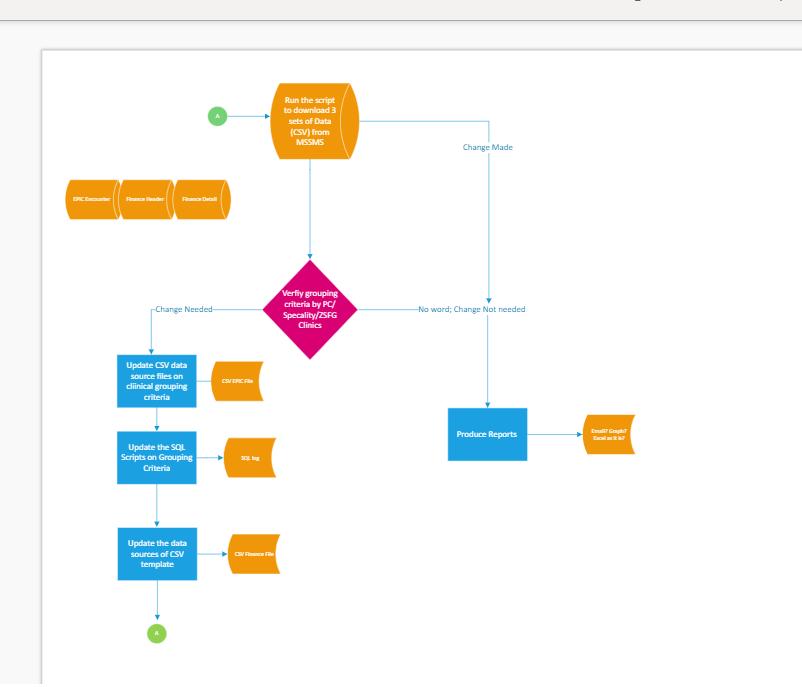

# Primary Care Payment 

The purpose of the project is to develop a data pipeline to visualize primary care payment for the hospitals. 

## Description

The necessity to claim earned but uncollected revenue is paramount for the financial well-being of the hospitals. Uncollected funds affect resources available to patients

## Getting Started

### Dependencies

* PowerBI, Python3, Microsoft SQL Server Management Studio 18, Visio 

### Installing

* PowerBI- Desktop Version 


### Executing program

* data flow diagram: visualize the data flow process: interative and iterative process to map out data flows in the system 

![Data Flow Diagram]

* [SQL Script to produce a CSV file that feeds into POWERBI for visualization] (Primary-Care-Payment/SQLFinalized.sql)

* 


* Step-by-step bullets
```
code blocks for commands
```

## Help

Any advise for common problems or issues.
```
command to run if program contains helper info
```

## Authors

Evan Xu

[@](https://twitter.com/)

## Version History

* 0.2
    * Various bug fixes and optimizations
    * See [commit change]() or See [release history]()
* 0.1
    * Initial Release

## License

This project is licensed under the [NAME HERE] License - see the LICENSE.md file for details

## Acknowledgments

Inspiration, code snippets, etc.
* [awesome-readme](https://github.com/matiassingers/awesome-readme)
* [PurpleBooth](https://gist.github.com/PurpleBooth/109311bb0361f32d87a2)
* [dbader](https://github.com/dbader/readme-template)
* [zenorocha](https://gist.github.com/zenorocha/4526327)
* [fvcproductions](https://gist.github.com/fvcproductions/1bfc2d4aecb01a834b46)
* [Template](https://gist.githubusercontent.com/DomPizzie/7a5ff55ffa9081f2de27c315f5018afc/raw/d59043abbb123089ad6602aba571121b71d91d7f/README-Template.md)
